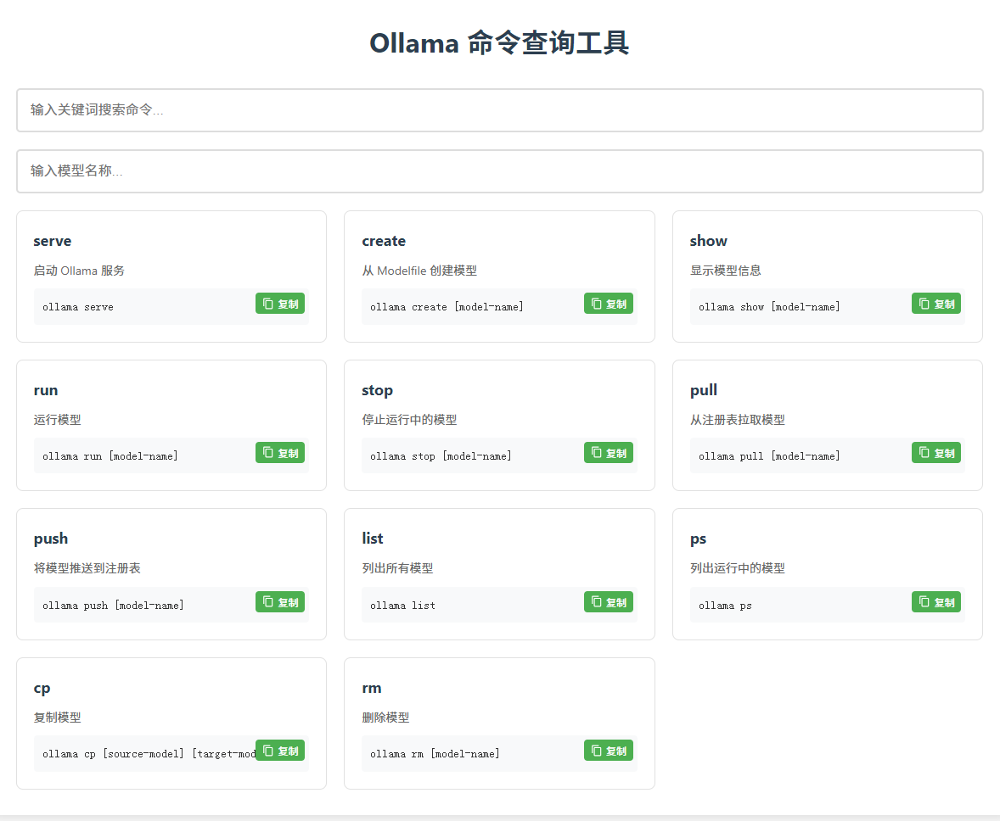

# Ollama 命令查询工具

这是一个基于 Web 的 Ollama 命令查询工具，提供了直观的图形界面来帮助用户快速查找和使用 Ollama 的各种命令。

## 功能特点

- 🚀 简洁美观的用户界面
- 🔍 实时命令搜索功能（支持正则表达式）
- 📋 一键复制命令（自动转换Windows/macOS路径格式）
- 📱 响应式设计，支持各种设备
- 🎯 智能模型名称补全
- 💡 带参数说明的命令示例
- 🌓 暗黑/明亮主题切换
- ⚡ 离线优先PWA支持

## 支持的命令

工具支持以下 Ollama 命令（v0.1.8+）：

- `serve` - 启动 Ollama 服务
- `create` - 从 Modelfile 创建模型
- `show` - 显示模型信息
- `run` - 运行模型
- `stop` - 停止运行中的模型
- `pull` - 从注册表拉取模型
- `push` - 将模型推送到注册表
- `list` - 列出所有模型
- `ps` - 列出运行中的模型
- `cp` - 复制模型
- `rm` - 删除模型

## 使用方法

1. 克隆仓库：
```bash
git clone https://github.com/yourusername/ollama-command-helper.git
```
2. 进入项目目录：
```bash
cd ollama-command-helper
```
3. 使用现代浏览器打开 `ollama-commands.html` 文件

## 界面预览



## 快捷键说明

- Ctrl/Cmd + F: 快速聚焦搜索框
- Enter: 执行当前选中命令
- Esc: 清空搜索内容

## 技术栈

- HTML5
- CSS3
- JavaScript (原生)

## 本地运行

直接在浏览器中打开 `ollama-commands.html` 文件即可使用。

## 贡献

欢迎提交 Issue 和 Pull Request 来帮助改进这个工具。

## 许可证

MIT License